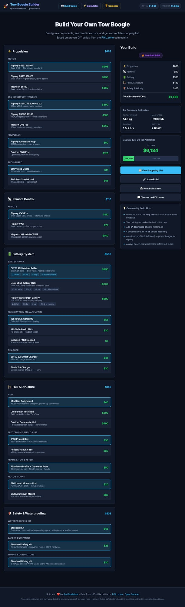
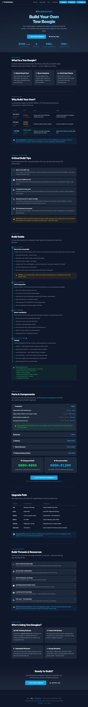
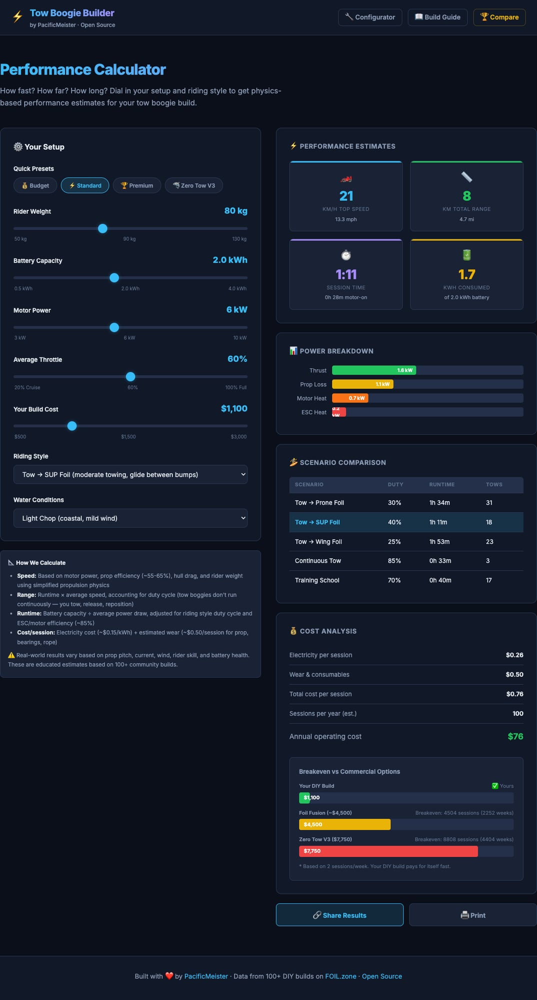
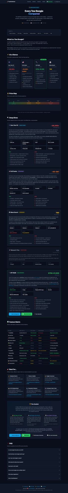

# ⚡ Tow Boogie Builder — The Complete DIY Toolkit

[](https://pacificmeister.github.io/towboogie-build/)
[](LICENSE)
[](https://foil.zone)
[](https://pacificmeister.github.io)

**Build your own electric tow boogie for $750–$1,200 — save $6,500+ vs commercial options.**

A complete, free tool suite for planning, building, and understanding DIY tow boggies (electric tow devices for prone foiling, SUP foiling, and wing foiling). Data sourced from 100+ real builds on [FOIL.zone](https://foil.zone), the world's largest DIY efoil community.

**Built by [PacificMeister](https://pacificmeister.github.io)** — the open-source eFoil pioneer who kickstarted the entire DIY efoil movement in 2016.

---

## 🛠️ Four Tools, One Mission

### 1. [Build Configurator](https://pacificmeister.github.io/towboogie-build/) — Pick Your Parts

Interactive component selector with real-time cost tracking. Choose your motor, ESC, battery, hull, remote, and safety gear — get an instant shopping list with buy links.

<details>
<summary>📸 Screenshot</summary>



</details>

**Features:**
- 30+ real components with specs, prices, and community ratings
- Real-time total cost, weight, and performance estimates
- Side-by-side comparison vs Zero Tow V3 ($7,750)
- One-click shopping list (copy to clipboard or print)
- Shareable builds via URL — send your config to friends
- Community build tips from 100+ proven DIY builds

---

### 2. [Build Guide](https://pacificmeister.github.io/towboogie-build/guide.html) — Step-by-Step Instructions

Complete DIY build guide with a 4-day assembly sequence, parts list, cost breakdown, and hard-won tips from the FOIL.zone community.

<details>
<summary>📸 Screenshot</summary>



</details>

**Covers:**
- What is a tow boogie and why build your own
- Critical build tips (motor position, tow point, 5° pitch angle)
- Day-by-day build sequence (electronics → hull → frame → testing)
- Complete parts list with budget and recommended tiers
- V1 → V2 upgrade path
- Links to real build threads on FOIL.zone

---

### 3. [Performance Calculator](https://pacificmeister.github.io/towboogie-build/calculator.html) — Know Before You Build

Physics-based calculator that estimates speed, range, runtime, and cost-per-session based on your specific setup and riding style.

<details>
<summary>📸 Screenshot</summary>



</details>

**Features:**
- 5 riding style profiles (prone foil, SUP foil, wing foil, continuous tow, training)
- Water condition adjustments (flat water → choppy)
- Power breakdown visualization (thrust, prop loss, heat)
- Scenario comparison table across riding styles
- Breakeven analysis vs Zero Tow V3 and Foil Fusion
- Shareable results via URL, print-friendly

---

### 4. [Buyer's Guide](https://pacificmeister.github.io/towboogie-build/compare.html) — Every Tow Boogie Compared

Comprehensive comparison of every tow boogie on the market: Zero Tow V3, Foil Fusion, Wave Escort, Takuma (discontinued), and DIY.

<details>
<summary>📸 Screenshot</summary>



</details>

**Includes:**
- At-a-glance comparison grid with prices and key specs
- Visual price map
- Deep-dive reviews of each option (pros, cons, specs, verdict)
- Full feature matrix (30+ features compared)
- 6 use-case recommendations ("Best for beginners", "Best value", etc.)
- 8-question FAQ

---

## 🎯 Who Is This For?

| You are... | Start here |
|---|---|
| Curious about tow boggies | [Buyer's Guide](https://pacificmeister.github.io/towboogie-build/compare.html) |
| Ready to build | [Build Guide](https://pacificmeister.github.io/towboogie-build/guide.html) |
| Picking parts | [Configurator](https://pacificmeister.github.io/towboogie-build/) |
| Optimizing your setup | [Performance Calculator](https://pacificmeister.github.io/towboogie-build/calculator.html) |
| Already building | [FOIL.zone community](https://foil.zone) — 5,300+ members, 135K+ posts |

## 💰 Why DIY?

| Option | Price | Wait Time |
|---|---|---|
| **Zero Tow V3** | $7,750+ | Weeks (ships from Australia) |
| **Foil Fusion** | ~$4,500 | Pre-order |
| **Wave Escort** | TBA | Pre-production |
| **DIY Build** | **$750–$1,200** | **Build in a weekend** |

A DIY tow boogie pays for itself vs commercial options in **zero sessions** — because you never spent $7,750 in the first place.

## 📊 Data Sources

All component data, build tips, and community insights come from real DIY builds documented on [FOIL.zone](https://foil.zone):

- [Chris's 2025 Tow Boogie Build](https://foil.zone/t/my-tow-boogie-build-2025/23796) — proven single-motor design
- [JDubs Dual Motor Build](https://foil.zone/t/jdubs-dual-motor-tow-boogie/19048) — high-performance dual setup
- [Tow Boogie General Design Thread](https://foil.zone/t/tow-boogie-general-design/20560) — 100+ posts of community R&D
- Market research across Zero Tow, Foil Fusion, Wave Escort, and Takuma

## 🚀 Deploy Your Own

Pure static site — no build step, no dependencies, no framework. Just HTML, CSS, and vanilla JS.

```bash
# Run locally
open index.html

# Or serve it
python3 -m http.server 8000

# Deploy to GitHub Pages (fork this repo, enable Pages)
# Deploy to Vercel
vercel deploy

# Deploy anywhere that serves static files
```

## 📁 Project Structure

```
├── index.html          # Build Configurator
├── guide.html          # DIY Build Guide
├── calculator.html     # Performance Calculator
├── compare.html        # Buyer's Guide & Comparison
├── app.js              # Configurator logic + component database
├── style.css           # Shared styles (dark ocean theme)
├── sitemap.xml         # SEO sitemap
├── robots.txt          # Search engine directives
├── 404.html            # Custom 404 with navigation
└── docs/
    └── screenshots/    # Tool screenshots for README
```

## 🤝 Contributing

This is an open-source community project. Contributions welcome:

- **Add components** — Know a good motor/ESC/battery? Open an issue or PR
- **Share your build** — Post on [FOIL.zone](https://foil.zone) and we'll add your data
- **Fix bugs** — Found something wrong? Issues and PRs are open
- **Translate** — Help make these tools accessible in other languages

## 🌊 About PacificMeister

[PacificMeister](https://pacificmeister.github.io) open-sourced the first DIY electric hydrofoil designs in 2016-17, kickstarting an entire global movement. Founded [FOIL.zone](https://foil.zone) — now the world's largest DIY efoil community with 5,300+ members and 135,000+ posts over 9 years.

**More tools:**
- [🏄 AXIS Foil Advisor](https://axis-advisor.vercel.app) — Foil selection wizard, comparison tool, and anti-counterfeit center
- [🌊 PacificMeister Hub](https://pacificmeister.github.io) — All projects and tools in one place

## 📄 License

[MIT](LICENSE) — Open source, like everything PacificMeister does. Use it, fork it, improve it, share it.

---

<p align="center">
  <b>Built with ❤️ for the foiling community</b><br>
  <a href="https://foil.zone">FOIL.zone</a> · <a href="https://pacificmeister.github.io">PacificMeister</a> · <a href="https://pacificmeister.github.io/towboogie-build/">Launch Tools →</a>
</p>
